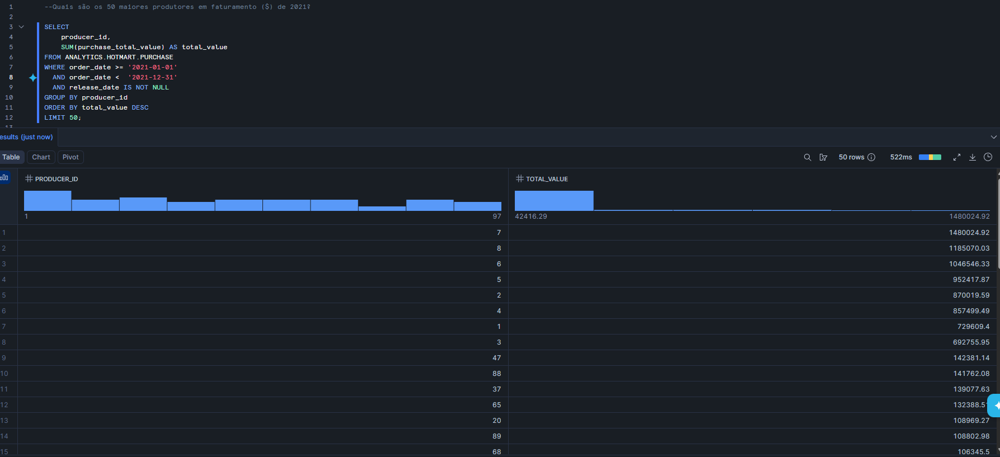
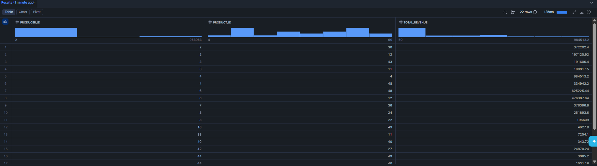
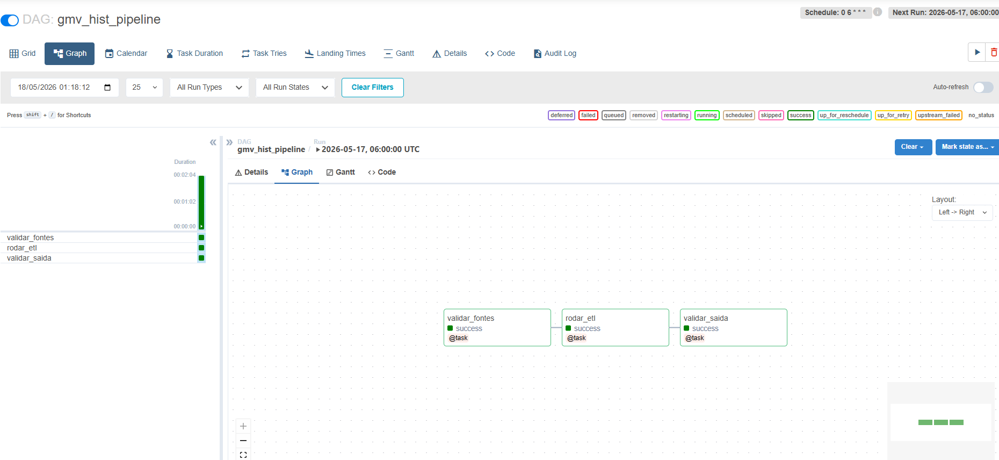
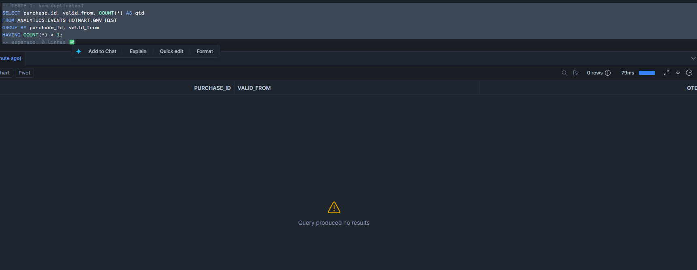
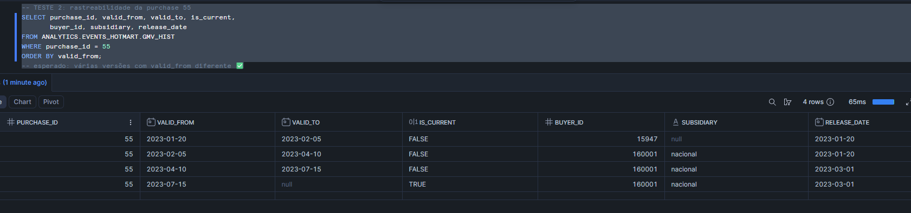
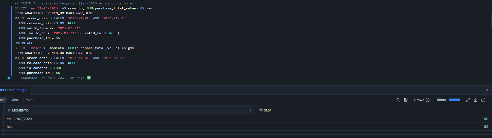
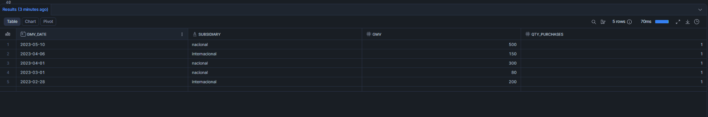

# Case Técnico — Analytics Engineer | Hotmart

Pipeline para calcular o **GMV diário por subsidiária** a partir de eventos transacionais em formato CDC (append-only), com modelagem **SCD Type 2** para garantir imutabilidade do passado e navegação temporal.

---

## Sumário

1. [Exercício 1 — SQL](#exercício-1--sql)
2. [Exercício 2 — Pipeline GMV Histórico](#exercício-2--pipeline-gmv-histórico)
3. [Decisões Técnicas](#decisões-técnicas)
4. [Estrutura do Projeto](#estrutura-do-projeto)
5. [Testes de Validação](#testes-de-validação)
6. [Como Rodar](#como-rodar)
7. [Tech stack](#7-tech-stack)

---

## Exercício 1 — SQL

Respostas em `sql/queries.sql`, schema `ANALYTICS.HOTMART`.

**Pergunta 1 — 50 maiores produtores em faturamento de 2021:**

```sql
SELECT
    producer_id,
    SUM(purchase_total_value) AS total_value
FROM ANALYTICS.HOTMART.PURCHASE
WHERE order_date >= '2021-01-01'
  AND order_date <  '2022-01-01'
  AND release_date IS NOT NULL          -- só conta compra paga
GROUP BY producer_id
ORDER BY total_value DESC
LIMIT 50;
```


**Pergunta 2 — Top 2 produtos por produtor:**

```sql
WITH product_revenue AS (
    SELECT
        pu.producer_id,
        pr.product_id,
        SUM(pu.purchase_total_value) AS total_revenue
    FROM ANALYTICS.HOTMART.PRODUCT_ITEM pr
    INNER JOIN ANALYTICS.HOTMART.PURCHASE pu
        ON pr.prod_item_id        = pu.prod_item_id
       AND pr.prod_item_partition = pu.prod_item_partition
    WHERE release_date IS NOT NULL
    GROUP BY pu.producer_id, pr.product_id
),
ranked_products AS (
    SELECT
        producer_id, product_id, total_revenue,
        ROW_NUMBER() OVER (PARTITION BY producer_id ORDER BY total_revenue DESC) AS rn
    FROM product_revenue
)
SELECT producer_id, product_id, total_revenue
FROM ranked_products
WHERE rn <= 2
ORDER BY producer_id, total_revenue DESC;
```


**Decisão de filtro:** `release_date IS NOT NULL` o campo `purchase_status` foi gerado randomicamente e nem sempre reflete o estado real da compra, então a única forma confiável de identificar pagamento confirmado é pela existência do `release_date`.

---

## Exercício 2 — Pipeline GMV Histórico

### Desafio

Três tabelas de eventos append-only (CDC), com chegada assíncrona:

| Tabela | Granularidade | Fornece |
|---|---|---|
| `purchase` | 1 evento por mudança | Compra, valor, status, datas |
| `product_item` | 1 evento por mudança | Produto, quantidade, valor unitário |
| `purchase_extra_info` | 1 evento por mudança | Subsidiária (nacional/internacional) |

**Requisitos:**

- Passado nunca pode mudar mesmo com reprocessamento completo
- Navegação temporal: GMV de jan/2023 em 31/03 vs hoje deve ser consistente
- Rastreabilidade diária (D-1) de todas as alterações
- Consulta final acessível a usuários sem SQL avançado

### Arquitetura

```
┌─────────────────────────────────────────────────────────────┐
│              FONTES (CDC append-only)                       │
│   purchase    product_item    purchase_extra_info           │
└──────────────────────┬──────────────────────────────────────┘
                       │
                       ▼
┌─────────────────────────────────────────────────────────────┐
│  [1] Great Expectations — valida as fontes                  │
└──────────────────────┬──────────────────────────────────────┘
                       │
                       ▼
┌─────────────────────────────────────────────────────────────┐
│  [2] Snowpark ETL — MERGE SCD2 em gmv_hist                  │
│      • Último evento do dia por entidade (QUALIFY)          │
│      • HASH para detectar mudança                           │
│      • Classifica NEW / CHANGED / UNCHANGED                 │
│      • Fecha versão antiga (UPDATE) + abre nova (INSERT)    │
└──────────────────────┬──────────────────────────────────────┘
                       │
                       ▼
┌─────────────────────────────────────────────────────────────┐
│  gmv_hist (SCD Type 2)                                      │
│    purchase_id │ valid_from │ valid_to │ is_current │ ...   │
│    55          │ 2023-01-20 │ 2023-02-05 │ FALSE    │ ...   │
│    55          │ 2023-02-05 │ 2023-04-10 │ FALSE    │ ...   │
│    55          │ 2023-04-10 │ NULL       │ TRUE     │ ...   │
└──────────────────────┬──────────────────────────────────────┘
                       │
                       ▼
┌─────────────────────────────────────────────────────────────┐
│  [3] Great Expectations — valida saída                      │
└──────────────────────┬──────────────────────────────────────┘
                       │
                       ▼
┌─────────────────────────────────────────────────────────────┐
│  v_gmv_current — view de consumo                            │
│  Sem SQL complexo: SELECT * FROM v_gmv_current              │
└─────────────────────────────────────────────────────────────┘
```

### Modelagem SCD Type 2

Três campos de controle preservam o histórico sem sobrescrever o passado:

| Campo | Significado |
|---|---|
| `valid_from` | Data em que essa versão entrou em vigor |
| `valid_to` | Data em que foi substituída (`NULL` = vigente) |
| `is_current` | `TRUE` = versão atual |

**Exemplo com a purchase 55** (4 eventos ao longo do tempo):

| valid_from | valid_to | is_current | buyer_id | release_date | purchase_total_value |
|---|---|---|---|---|---|
| 2023-01-20 | 2023-02-05 | FALSE | 15947  | NULL       | 50 |
| 2023-02-05 | 2023-04-10 | FALSE | 160001 | NULL       | 50 |
| 2023-04-10 | 2023-07-15 | FALSE | 160001 | NULL       | 80 |
| 2023-07-15 | NULL       | **TRUE**  | 160001 | 2023-03-01 | 80 |

### Detecção de mudança via HASH

Em vez de comparar coluna a coluna (10 campos com `IFNULL + CAST`), o ETL usa `HASH(...)` sobre os campos de negócio e compara apenas dois números. Resulta em código mais limpo e leitura mais barata:

```sql
HASH(
    pu.buyer_id, pu.producer_id, pi.product_id,
    ex.subsidiary, pu.purchase_status,
    pu.order_date, pu.release_date,
    pu.purchase_total_value, pi.item_quantity, pi.purchase_value
) AS row_hash
```

### Classificação NEW / CHANGED / UNCHANGED

O MERGE separa as 3 situações antes de agir:

```sql
CASE
    WHEN h.purchase_id IS NULL    THEN 'NEW'         -- nunca foi vista
    WHEN h.row_hash != s.row_hash THEN 'CHANGED'     -- versão atual mudou
    ELSE 'UNCHANGED'                                 -- igual, não faz nada
END AS change_type
```

E gera duas linhas para cada `CHANGED` (uma `CLOSE` na versão antiga e uma `OPEN` na nova), enquanto `NEW` gera só `OPEN`. Isso permite resolver fechamento e abertura em um único MERGE.

---

## Decisões Técnicas

| Decisão | Justificativa |
|---|---|
| **Snowflake** | Clustering nativo por `transaction_date`, `QUALIFY` evita subqueries para deduplicação |
| **Snowpark (Python)** | Compute no próprio warehouse, sem cluster Spark externo; integra direto com o Airflow |
| **SCD Type 2** | Único padrão que atende imutabilidade + navegação temporal sem perder histórico |
| **HASH para mudança** | Compara 1 inteiro em vez de 10 colunas com tratamento de NULL |
| **View `v_gmv_current`** | Camada de consumo sem lógica temporal exposta — usuário só faz `SELECT * FROM v_gmv_current` |
| **`release_date IS NOT NULL`** | Único campo confiável para identificar pagamento (status é manual) |
| **Great Expectations** | Validação antes e depois do ETL com relatório HTML auditável |
| **Airflow (Docker)** | Orquestração D-1 com retry automático, fácil de subir local |

### Anti-patterns evitados

- **UPDATE direto** no registro quando muda → perderia o histórico
- **Lógica temporal exposta ao usuário final** → resolvida via view `v_gmv_current`
- **Hardcode de datas** → `ref_date` é parâmetro do pipeline

---

## Estrutura do Projeto

### Orquestração Airflow



### Estrutura do repositório

```
analytics_engineer_hotmart/
├── airflow/
│   ├── dags/gmv_hist_dag.py          # DAG D-1 com Airflow
│   └── docker-compose.yml            # ambiente local
├── gx/                               # contexto Great Expectations
│   ├── checkpoints/                  # checkpoints de validação
│   ├── expectations/                 # suites por tabela
│   └── great_expectations.yml
├── queries/
│   └── ddl/gmv_hist.sql              # MERGE SCD2 (parametrizado por {ref_date})
├── sql/
│   └── queries.sql                   # exercício 1
├── etl_with_gx.py                    # pipeline principal
├── gx_setup.py                       # cria contexto e suites
├── gx_expectations.py                # define expectations por tabela
├── gx_checkpoints.py                 # cria e roda checkpoints
├── requirements.txt
└── .env                              # credenciais Snowflake
```

### Expectations principais

| Tabela | Regras |
|---|---|
| `purchase` | `purchase_id` not null > 0; `purchase_status` ∈ {INICIADA, APROVADA, CANCELADA, REEMBOLSADA}; `purchase_total_value` ≥ 0 |
| `product_item` | `prod_item_id` not null > 0; `item_quantity` ≥ 1; `purchase_value` ≥ 0 |
| `purchase_extra_info` | `subsidiary` ∈ {nacional, internacional} (mostly 0.90 — chegada assíncrona) |
| `gmv_hist` | PK `(purchase_id, valid_from)` única; `is_current` ∈ {TRUE, FALSE}; `valid_from` ≥ 2020-01-01 |

O `mostly=0.90` em `subsidiary` reflete a realidade de CDC: o dado pode chegar dias depois do evento de compra.

---

## Testes de Validação

### Teste 1 — Sem duplicatas

```sql
SELECT purchase_id, valid_from, COUNT(*) AS qtd
FROM ANALYTICS.EVENTS_HOTMART.GMV_HIST
GROUP BY purchase_id, valid_from
HAVING COUNT(*) > 1;
-- esperado: 0 linhas ✅
```


### Teste 2 — Rastreabilidade da purchase 55

Cenário simulado: o ETL rodou para `2023-01-20`, `2023-02-05`, `2023-04-10` e `2023-07-15`.

```sql
SELECT purchase_id, valid_from, valid_to, is_current,
       buyer_id, release_date, purchase_total_value
FROM ANALYTICS.EVENTS_HOTMART.GMV_HIST
WHERE purchase_id = 55
ORDER BY valid_from;
-- esperado: 4 versões com is_current=TRUE apenas na última ✅
```


### Teste 3 — Navegação temporal

A purchase 55 teve seu valor alterado de 50 para 80 em abril/2023. O GMV de janeiro consultado em março deve retornar 50; consultado hoje, retorna 80.

```sql
SELECT 'em 31/03/2023' AS momento, SUM(purchase_total_value) AS gmv
FROM ANALYTICS.EVENTS_HOTMART.GMV_HIST
WHERE order_date BETWEEN '2023-01-01' AND '2023-01-31'
  AND release_date IS NOT NULL
  AND valid_from  <= '2023-03-31'
  AND (valid_to    > '2023-03-31' OR valid_to IS NULL)
UNION ALL
SELECT 'hoje', SUM(purchase_total_value)
FROM ANALYTICS.EVENTS_HOTMART.GMV_HIST
WHERE order_date BETWEEN '2023-01-01' AND '2023-01-31'
  AND release_date IS NOT NULL
  AND is_current = TRUE;
-- esperado: 50 em 31/03 | 80 hoje ✅
```



### Consulta final — GMV diário por subsidiária

Para simplificar o consumo analítico por usuários que não possuem conhecimento avançado em SQL ou em modelagem temporal, foi criada a view v_gmv_current, que expõe apenas o estado atual e válido das compras.

A view considera apenas registros ativos (is_current = TRUE);
considera apenas compras efetivadas (release_date IS NOT NULL), seguindo a definição de GMV;
abstrai a complexidade da lógica histórica da tabela SCD2.

```sql
CREATE OR REPLACE VIEW ANALYTICS.EVENTS_HOTMART.v_gmv_current AS
SELECT
    purchase_id,
    buyer_id,
    producer_id,
    product_id,
    subsidiary,
    purchase_status,
    order_date,
    release_date,
    purchase_total_value,
    item_quantity,
    purchase_value,
    valid_from                AS effective_since
FROM ANALYTICS.EVENTS_HOTMART.gmv_hist
WHERE is_current      = TRUE
  AND release_date    IS NOT NULL;
```

Query Analítica:

```sql
SELECT
    release_date              AS gmv_date,
    subsidiary,
    SUM(purchase_total_value) AS gmv,
    COUNT(DISTINCT purchase_id) AS qty_purchases
FROM ANALYTICS.EVENTS_HOTMART.v_gmv_current
GROUP BY release_date, subsidiary
ORDER BY release_date DESC, subsidiary;
```



---

## Como Rodar

### 1. Setup local

```powershell
python -m venv .venv
.venv\Scripts\activate
pip install -r requirements.txt
```

### 2. Configurar `.env`

```dotenv
SNOWFLAKE_ACCOUNT=seu_account
SNOWFLAKE_USER=seu_user
SNOWFLAKE_PASSWORD=sua_senha
SNOWFLAKE_DATABASE=ANALYTICS
SNOWFLAKE_SCHEMA=EVENTS_HOTMART
SNOWFLAKE_WAREHOUSE=TRANSFORMING
SNOWFLAKE_ROLE=ACCOUNTADMIN
```

### 3. Inicializar Great Expectations

```powershell
python gx_setup.py            # contexto + datasource
python gx_expectations.py     # cria expectations
python gx_checkpoints.py      # cria e roda checkpoints
```

### 4. Rodar o ETL

```powershell
# para uma data específica
python etl_with_gx.py 2023-01-20

# para D-1 (padrão)
python etl_with_gx.py
```

### 5. Subir o Airflow (opcional)

```powershell
cd airflow
docker compose up airflow-init                       # primeira vez
docker compose up -d airflow-webserver airflow-scheduler
```

Acesse `http://localhost:8080` (admin / admin) e dispare a DAG `gmv_hist_pipeline`.

---

### 7. Tech stack

| Camada | Tecnologia | Por quê |
|---|---|---|
| **Data Warehouse** | Snowflake | Separação compute/storage, micro-partitions, `CLUSTER BY`, MERGE eficiente, custo previsível |
| **Linguagem** | Python 3.11 | Familiaridade do time, ecossistema maduro de DQ/orquestração |
| **Conector** | Snowpark | Session bem comportada, suporta DataFrame API se o pipeline crescer |
| **DQ** | Great Expectations | Suites versionáveis em Git, Data Docs HTML auditáveis |
| **Configuração** | python-dotenv | Credenciais fora do código, padrão 12-factor |
| **Orquestração** | Airflow / Prefect / Dagster (sugerido) | DAG diário em D-1, retries, alertas |
| **Versionamento** | Git + PR review | Toda mudança em SQL passa por code review |


**Autora:** Luciana Simioni
